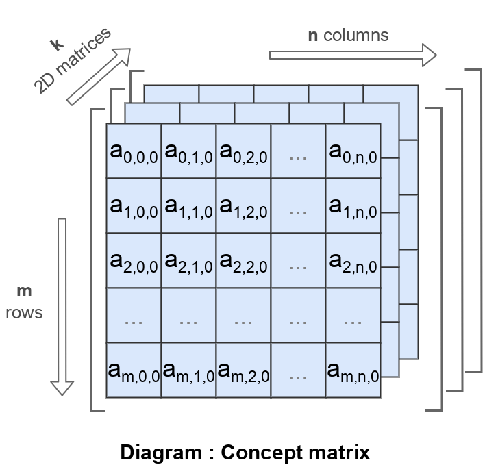

# Матриця

Матриця це прямокутний масив чисел, символів чи виразів організований рядками та колонками.

За замовчуванням матриця має два виміри. В нашій реалізації матриця може мати більше двох вимірів.

[Повернутись до змісту](../README.md#Концепції)
