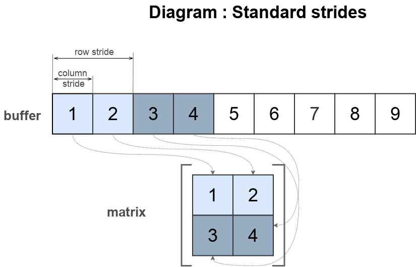

# Використання опції strides

Як використати опцію <code>stride</code> для інтерпретації буфера як матрицю.

### Стандартна ширина кроку

```js
var matrix = _.Matrix
({
  buffer : [ 1, 2, 3, 4, 5, 6, 7, 8, 9 ],
  dims : [ 2, 2 ],
  strides : [ 2, 1 ],
  inputTransposing : 1,
});

console.log( `matrix :\n${ matrix.toStr() }` );
/*
log : matrix :
+1, +2,
+3, +4,
*/
console.log( `strides :\n${ matrix.strides }` );
/* log : strides :
[ 2, 1 ]
*/
console.log( `effective strides :\n${ matrix._stridesEffective }` );
/* log : effective strides :
[ 2, 1 ]
*/
```

Поле `strides` показує явно задані кроки в матриці. Якщо крок не задано явно, то діючі значення можна перевірити в полі `_stridesEffective`.

```js
var matrix = _.Matrix
({
  buffer : [ 1, 2, 3, 4, 5, 6, 7, 8, 9 ],
  dims : [ 2, 2 ],
  inputTransposing : 1,
});

console.log( `matrix :\n${ matrix.toStr() }` );
/* log : matrix :
+1, +2,
+3, +4,
*/
console.log( `strides :\n${ matrix.strides }` );
/* log : strides :
null
*/
console.log( `effective strides :\n${ matrix._stridesEffective }` );
/* log : effective strides :
[ 2, 1 ]
*/
```



Приведена діаграма показано як буфер інтерпретується в матрицю. Кожен рядок формується із ділянки буфера, наступний рядок слідує за попереднім.

### Нестандартна ширина кроку

```js
var matrix = _.Matrix
({
  buffer : [ 1, 2, 3, 4, 5, 6, 7, 8, 9 ],
  dims : [ 2, 2 ],
  strides : [ 4, 2 ]
});

console.log( `matrix :\n${ matrix.toStr() }` );
/* log : matrix :
+1, +3,
+5, +7,
*/
```

Значення першого елемента в опції `strides` визначає крок для рядків, другого - для колонок.


Діаграма показує як розміщуються елементи матриці в буфері `buffer`. Зміщення немає, тому матриця починається з першого елемента, має зміщення рядка - 4 елементи, а колонки - 2.


### Негативна ширина кроку

```js
var matrix = _.Matrix
({
  buffer : [ 1, 2, 3, 4, 5, 6, 7, 8, 9 ],
  dims : [ 2, 2 ],
  offset : 8,
  strides : [ -2, -1 ],
});

console.log( `matrix :\n${ matrix.toStr() }` );
/* log : matrix :
+9, +8,
+7, +6,
*/
```

При використанні негативних значень в опції `strides` відлік елементів ведеться в зворотньому напряму від зміщення в буфері.


Діаграма показує як розміщуються елементи матриці в буфері `buffer`. Матриця має максимальне зміщення до елементу з індексом 8. Відлік елементів ведеться у зворотньому напрямі: крок для рядків - -2 елемента, для колонок - -1 елемент.


### Транспонована матриця з кроком

Для транспонування матриці можна змінити порядок значень в опції `strides`.

```js
var buffer1 = new I32x( [ 0, 1, 2, 3, 4, 5, 6, 7, 8, 9 ] );

var matrix = _.Matrix
({
  buffer : buffer1,
  dims : [ 2, 2 ],
  strides : [ 4, 2 ],
  offset : 1,
});

console.log( `matrix :\n${ matrix.toStr() }` );
/* log : matrix :
+1, +3,
+5, +7,
*/

var matrixTransposed = _.Matrix
({
  buffer : buffer1,
  dims : [ 2, 2 ],
  strides : [ 2, 4 ],
  offset : 1,
});
console.log( `transposed matrix :\n${ matrixTransposed.toStr() }` );
/* log : transposed matrix :
+1, +5,
+3, +7,
*/
```


Приведена діаграма показано як буфер інтерпретується в матрицю. При зміні опції `strides` проходить транспонування матриці без копіювання буфера.

### Багатовимірна матриця

...

[Повернутись до змісту](../README.md#Туторіали)
