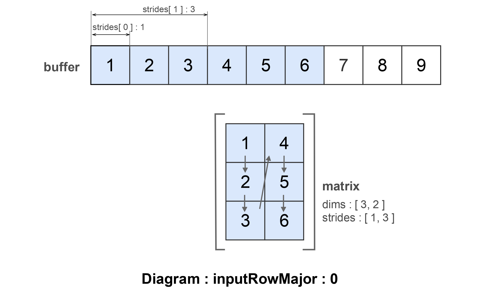
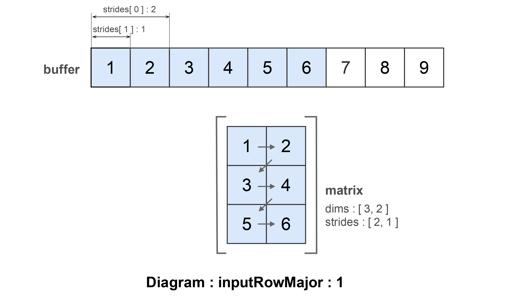
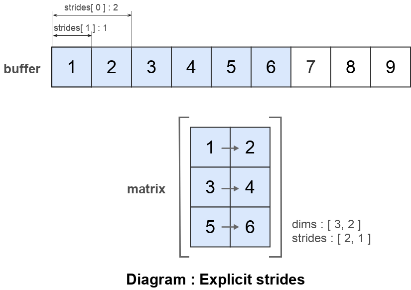
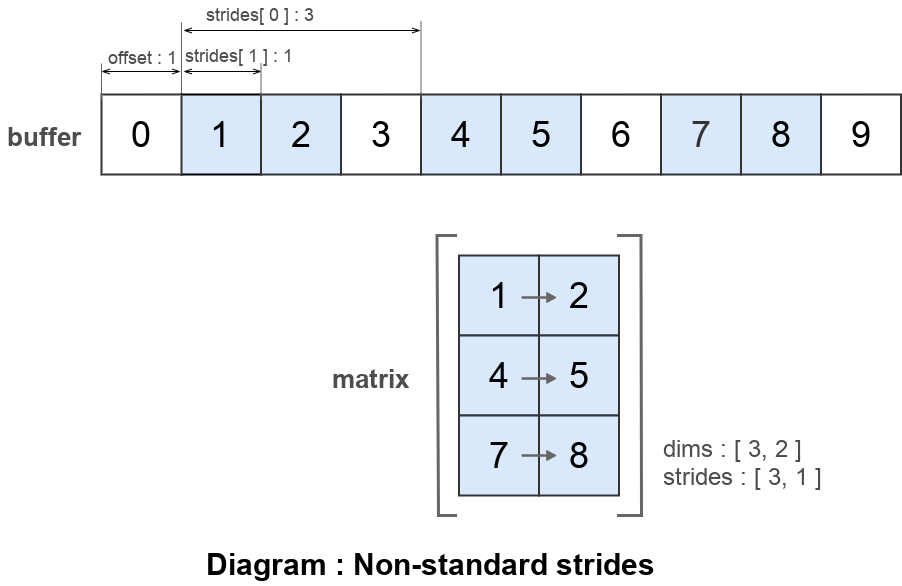
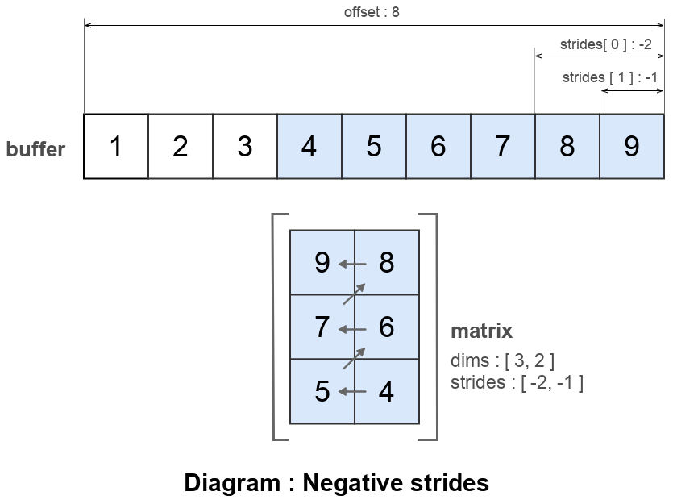
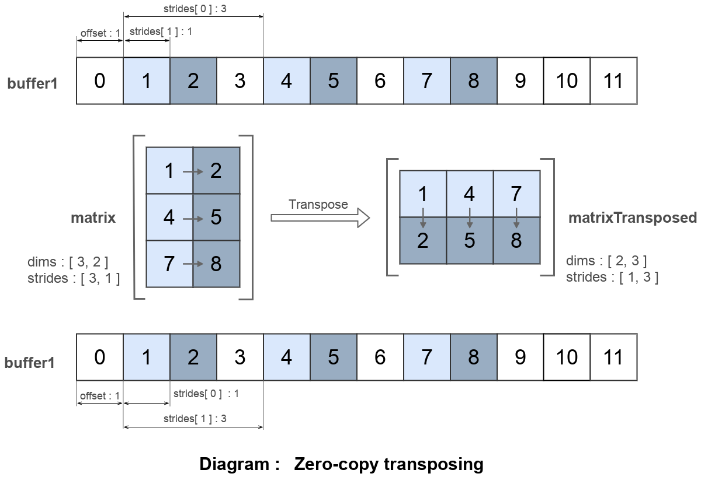
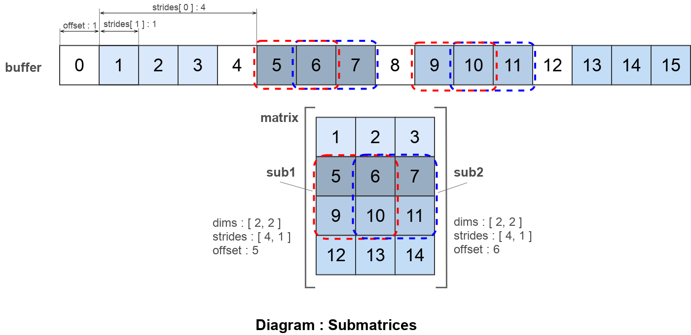

# Як використовувати опцію strides

Як використати опцію <code>strides</code> для інтерпретації буфера як матриці.

### Стандартна ширина кроку

Об'єкт класу `Matrix` можливо створити явним викилком конструктора.

```js
var matrix = new _.Matrix
({
  buffer : [ 1, 2, 3, 4, 5, 6, 7, 8, 9 ],
  dims : [ 3, 2 ],
  inputRowMajor : 0,
});
console.log( `matrix :\n${ matrix }` );
/* log : matrix :
Matrix.Array.3x2 ::
  +1 +4
  +2 +5
  +3 +6
*/
console.log( `effective strides :\n${ matrix.stridesEffective }` );
/* log : effective strides :
[ 1, 3 ]
*/
```

Три опції - це мінімальний обсяг інформації, котрий потрібен конструктору матриці. Буфер із даними `buffer`, інформація про виміри `dims` та опція `inputRowMajor` - інформація про те чи вхідні дані є в транспонованій формі.

За замовчуванням в буфері елементи йдуть в такій послідовності:



Якщо задати значення опції `inputRowMajor : 1`, тоді ширина кроку буде порахована за альтернативним алгоритмом.

```js
var matrix = new _.Matrix
({
  buffer : [ 1, 2, 3, 4, 5, 6, 7, 8, 9 ],
  dims : [ 3, 2 ],
  inputRowMajor : 1,
});
console.log( `matrix :\n${ matrix }` );
/* log : matrix :
Matrix.Array.3x2 ::
  +1 +2
  +3 +4
  +5 +6
*/
console.log( `effective strides :\n${ matrix.stridesEffective }` );
/* log : effective strides :
[ 2, 1 ]
*/
```

Із `inputRowMajor : 1` ширина кроку буде `[ 2, 1 ]`, а не `[ 1, 2 ]` як в попередньому прикладі. Послідовність виглядає так:



Опція `inputRowMajor` підказує конструктору, які порахувати ширину кроку, альтернативно можливо вказати ширину кроку явно:

```js
var matrix = new _.Matrix
({
  buffer : [ 1, 2, 3, 4, 5, 6, 7, 8, 9 ],
  dims : [ 3, 2 ],
  strides : [ 2, 1 ],
});
console.log( `matrix :\n${ matrix }` );
/* log : matrix :
Matrix.Array.3x2 ::
  +1 +2
  +3 +4
  +5 +6
*/
console.log( `effective strides :\n${ matrix.stridesEffective }` );
/* log : effective strides :
[ 2, 1 ]
*/
```

В результаті явного задання ширини кроку матриця точно така ж як і в попередньому прикладі.



Приведена діаграма показує як буфер відображається ( map into ) в матрицю. Всі скаляри йдуть послідовно один за одним. За замовчуванням `strides` обраховується так щоб всі скаляри йшли послідовно. В якій же послідовності йдуть рядок та колонка вказує опція `inputRowMajor`.

Альтернативно для створення нової матриці можливо використати одну із [статичних рутин](./MatrixCreation.md) `_.Matrix.Make*`.

### Нестандартна ширина кроку

Можливо задати будь-які значення ширини кроку ( в межах допустимих ) при її конструюванні.

```js
var matrix = new _.Matrix
({
  buffer : [ 1, 2, 3, 4, 5, 6, 7, 8, 9 ],
  dims : [ 3, 2 ],
  strides : [ 3, 1 ],
  offset : 1,
});

console.log( `matrix :\n${ matrix }` );
/* log : matrix :
Matrix.Array.3x2 ::
  +1 +2
  +4 +5
  +7 +8
*/
```

Значення першого елемента в опції `strides` визначає те, який відступ потрібно зробити щоб отримати наступний скаляр даної колонки. Значення другого елемента в опції `strides` визначає те, який відступ потрібно зробити щоб отримати наступний скаляр даного рядка.



Діаграма показує як розміщуються скаляри матриці в буфері `buffer`. Зміщення в буфері - один елемент. `strides` має значення `[ 3, 1 ]`.

### Негативна ширина кроку

```js
var matrix = new _.Matrix
({
  buffer : [ 1, 2, 3, 4, 5, 6, 7, 8, 9 ],
  dims : [ 3, 2 ],
  offset : 8,
  strides : [ -2, -1 ],
});
console.log( `matrix :\n${ matrix }` );
/* log : matrix :
Matrix.Array.3x2 ::
  +9 +8
  +7 +6
  +5 +4
*/
```

Матриці `matrix` задається негативні ширини кроку `-2, -1` що призводить то інтерпретації буфера в матрицю в протилежному напрямку.



Діаграма показує як розміщуються елементи матриці в буфері `buffer`. Матриця має максимальне зміщення до елементу з індексом 8. Відлік елементів ведеться у зворотньому напрямку і починається із останнього елемента буфера.

### Zero-copy транспонування

Транспонування матриці можливо здійснити без пересування даних в буфері матриці. Транспонування матриці можливо виконати лише зміною ширини кроку( strides ). В наступному прикладі здійснюється zero-copy транспонування матриці.

```js
var buffer1 = new I32x( [ 0, 1, 2, 3, 4, 5, 6, 7, 8, 9, 10, 11 ] );
var matrix = new _.Matrix
({
  buffer : buffer1,
  dims : [ 3, 2 ],
  strides : [ 3, 1 ],
  offset : 1,
});
console.log( `matrix :\n${ matrix }` );
/* log : matrix :
Matrix.I32x.3x2 ::
  +1 +2
  +4 +5
  +7 +8
*/
var matrixTransposed = new _.Matrix
({
  buffer : buffer1,
  dims : [ 2, 3 ],
  strides : [ 1, 3 ],
  offset : 1,
});
console.log( `transposed matrix :\n${ matrixTransposed }` );
/* log : transposed matrix :
Matrix.I32x.2x3 ::
  +1 +4 +7
  +2 +5 +8
*/
```

Обидві матриці `matrix` та `matrixTransposed` використовуються той самий буфер, але по різному його інтерпретують. Транспонування здійснюється зміною того як інтерпретується буфер `buffer1`. Матриця `matrixTransposed` використовує інші ширини кроків та розмірність чим це і досягається.

Саме так працює метод `matrix.transpose()`.

```js
var buffer1 = new I32x([ 0, 1, 2, 3, 4, 5, 6, 7, 8, 9, 10, 11 ]);
var matrix = new _.Matrix
({
  buffer : buffer1,
  dims : [ 3, 2 ],
  strides : [ 3, 1 ],
  offset : 1,
});
console.log( `matrix :\n${ matrix }` );
/* log : matrix :
Matrix.I32x.3x2 ::
  +1 +2
  +4 +5
  +7 +8
*/
matrix.transpose();
console.log( `transposed matrix :\n${ matrix }` );
/* log : transposed matrix :
Matrix.I32x.2x3 ::
  +1 +4 +7
  +2 +5 +8
*/
```

Розмірність та ширини кроку матриці `matrix` змінюються методом `matrix.transpose()` точно так само, як в попередньому прикладі, що призводить до її транспонування.



Приведена діаграма показано як буфер інтерпретується в матрицю. При зміні ширин кроків та розмірностей відбувається транспонування матриці без зміни даних в буфері `buffer1`.

### Підматриці

```js
var matrix = new _.Matrix
({
  buffer : [ 0, 1, 2, 3, 4, 5, 6, 7, 8, 9, 10, 11, 12, 13, 14, 15 ],
  dims : [ 4, 3 ],
  offset : 1,
  strides : [ 4, 1 ],
});
console.log( `matrix :\n${ matrix }` );
/* log : matrix :
Matrix.Array.4x3 ::                                                                                                                                                    [10/
  +1 +2 +3
  +5 +6 +7
  +9 +10 +11
  +13 +14 +15
*/
var sub1 = matrix.submatrix( [ 1, 2 ], [ 0, 1 ] );
console.log( `submatrix1 :\n${ sub1 }` );
/* log : submatrix1 :
Matrix.Array.2x2 ::
  +5 +6
  +9 +10
*/
var sub2 = matrix.submatrix( [ 1, 2 ], [ 1, 2 ] );
console.log( `submatrix2 :\n${ sub2 }` );
/* log : submatrix2 :
Matrix.Array.2x2 ::
  +6 +7
  +10 +11
*/
sub1.mul( [ sub1, 2 ] );
sub2.mul( [ sub2, 10 ] );
console.log( `matrix :\n${ matrix }` );
/* log : matrix :
Matrix.Array.4x3 ::
  +1 +2 +3
  +10 +120 +70
  +18 +200 +110
  +13 +14 +15
*/
```



На приведеній діаграмі показано як дві підматриці `sub1` та `sub2` одної матриці `matrix` можуть бути використані незалежно одна від одної. Пунктирами показано як підматриці розміщуються в буфері та у відповідній матриці. Всі матриці використовують один буфер, тому скаляри спільні для підматриць збільшились в `20` разів.

[Повернутись до змісту](../README.md#Туторіали)
