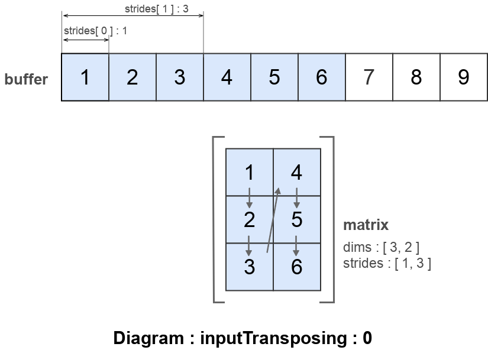
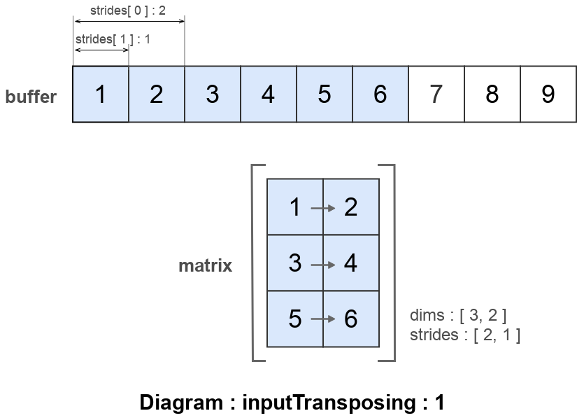
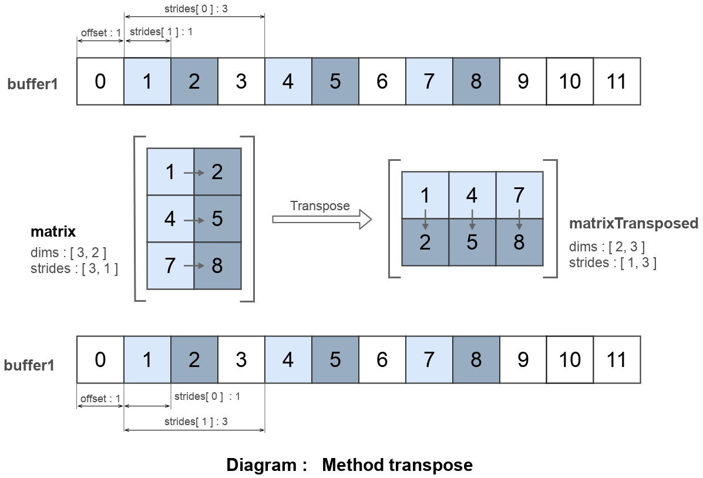

# Використання опції strides

Як використати опцію <code>stride</code> для інтерпретації буфера як матриці.

### Стандартна ширина кроку

Об'єкт класа `Matrix` можливо створити одним із заданням значень полів об'єкта.

```js

var matrix = _.Matrix
({
  buffer : [ 1, 2, 3, 4, 5, 6, 7, 8, 9 ],
  dims : [ 3, 2 ],
  inputTransposing : 0,
});

console.log( `matrix :\n${ matrix.toStr() }` );
/* log : matrix :
+1, +4,
+2, +5,
+3, +6,
*/

console.log( `effective strides :\n${ matrix._stridesEffective }` );
/* log : effective strides :
[ 1, 3 ]
*/

```

Три опції - це мінімальний обсяг інформації, котрий потрібен конструктору матриці. Буфер із даними `buffer`, інформація про виміри `dims` та опція `inputTransposing` - інформація про те чи вхідні дані є в транспонованій формі.

За замовчуванням в буфері елементи йдуть в такій послідовності:



Якщо задати значення опції `inputTransposing : 1`, тоді ширина кроку буде порахована за альтернативним алгоритмом.

```js

var matrix = _.Matrix
({
  buffer : [ 1, 2, 3, 4, 5, 6, 7, 8, 9 ],
  dims : [ 3, 2 ],
  inputTransposing : 1,
});

console.log( `matrix :\n${ matrix.toStr() }` );
/* log : matrix :
+1, +2,
+3, +4,
+5, +6,
*/

console.log( `effective strides :\n${ matrix._stridesEffective }` );
/* log : effective strides :
[ 2, 1 ]
*/

```

Якщо задати значення опції `inputTransposing : 1` тоді ширина кроку заданих прикладу буде [ 2, 1 ]:



Опція `inputTransposing` підказує конструктору, які порахувати ширину кроку, альтернативно можливо вказати ширину кроку явно:

```js

var matrix = _.Matrix
({
  buffer : [ 1, 2, 3, 4, 5, 6, 7, 8, 9 ],
  dims : [ 3, 2 ],
  strides : [ 2, 1 ],
});

console.log( `matrix :\n${ matrix.toStr() }` );
/* log : matrix :
+1, +2,
+3, +4,
+5, +6,
*/

console.log( `effective strides :\n${ matrix._stridesEffective }` );
/* log : effective strides :
[ 2, 1 ]
*/

```

Останній приклад ілюструється наступною діаграмою.


Приведена діаграма показує як буфер відображається ( map into ) в матрицю. Всі скаляри йдуть послідовно один за одним. За замовчуванням `strides` обраховується так щоб всі скаляри йшли послідовно. В якій же послідовності перебирати розмірності вказує оція `inputTransposing`.

Альтернативно для створення нової матриці можливо використати одну із [статичних рутин](./MatrixCreation.md) `_.Matrix.Make*`.

### Нестандартна ширина кроку

Ширина кроку може мати довільні значення, які можливо задати явно при конструюванні матриці.

```js
var matrix = _.Matrix
({
  buffer : [ 1, 2, 3, 4, 5, 6, 7, 8, 9 ],
  dims : [ 3, 2 ],
  strides : [ 3, 1 ],
  offset : 1,
});

console.log( `matrix :\n${ matrix.toStr() }` );
/* log : matrix :
+1, +2,
+4, +5,
+7, +8,
*/
```

Значення першого елемента в опції `strides` визначає те який відступ потрібно зробити щоб отримати наступний елемент даної колонки. Значення другого елемента в опції `strides` визначає те який відступ потрібно зробити щоб отримати наступний елемент даного рядка.


Діаграма показує як розміщуються елементи матриці в буфері `buffer`. Зміщення в буфері - один елемент. `strides` має значення `[ 3, 1 ]`.


### Негативна ширина кроку

```js
var matrix = _.Matrix
({
  buffer : [ 1, 2, 3, 4, 5, 6, 7, 8, 9 ],
  dims : [ 3, 2 ],
  offset : 8,
  strides : [ -2, -1 ],
});

console.log( `matrix :\n${ matrix.toStr() }` );
/* log : matrix :
+9, +8,
+7, +6,
+5, +4,
*/
```

При використанні негативних значень в опції `strides` відлік елементів ведеться в зворотньому напряму від зміщення в буфері.


Діаграма показує як розміщуються елементи матриці в буфері `buffer`. Матриця має максимальне зміщення до елементу з індексом 8. Відлік елементів ведеться у зворотньому напрямі: крок для рядків - -3 елемента, для колонок - -1 елемент.

### Zero-copy транспонування

Транспонування матриці можливо здійнити без пересування даних в буфері матриці. Транспонування квадратної матриці можливо виконати лише зміною ширини кроку( strides ). В наступному прикладі здійснюється zero-copy транспонування матриці.

```js
var buffer1 = new I32x( [ 0, 1, 2, 3, 4, 5, 6, 7, 8, 9, 10, 11 ] );

var matrix = _.Matrix
({
  buffer : buffer1,
  dims : [ 3, 2 ],
  strides : [ 3, 1 ],
  offset : 1,
});

console.log( `matrix :\n${ matrix.toStr() }` );
/* log : matrix :
+1, +2,
+4, +5,
+7, +8,
*/

var matrixTransposed = _.Matrix
({
  buffer : buffer1,
  dims : [ 2, 3 ],
  strides : [ 1, 3 ],
  offset : 1,
});
console.log( `transposed matrix :\n${ matrixTransposed.toStr() }` );
/* log : transposed matrix :
+1, +2, +4,
+5, +7, +9,
*/
```

Обидві матриці `matrix` та `matrixTransposed` використовуються той самий буфер, але по різному його інтерпретують. Транспонування здійснюється зміною того як інтерпретується буфер `buffer1`. Матриця `matrixTransposed` використовує інші ширини кроків та розмірність чим це і досягається.

Саме так працює метод `matrix.transpose()`.

```js
...
```

Розмірність та ширини кроку матриці `matrix` змінюються методом `matrix.transpose()` точно так само, як в попередньому прикладі, що призвотиь до її транспонування.


Приведена діаграма показано як буфер інтерпретується в матрицю. При зміні ширин кроків та розмірностей відбувається транспонування матриці без зміни даних в буфері `buffer1`.

Матрицю можливо транспонувати методом `transpose`.

```js
var buffer1 = new I32x( [ 0, 1, 2, 3, 4, 5, 6, 7, 8, 9, 10, 11 ] );

var matrix = _.Matrix
({
  buffer : buffer1,
  dims : [ 3, 2 ],
  strides : [ 3, 1 ],
  offset : 1,
});

console.log( `matrix :\n${ matrix.toStr() }` );
/* log : matrix :
+1, +2,
+4, +5,
+7, +8,
*/

matrix.transpose();
console.log( `transposed matrix :\n${ matrix.toStr() }` );
/* log : transposed matrix :
+1, +2, +4,
+5, +7, +9,
*/
```



При використанні методу значення полів `dims` i `strides` змінюються автоматично.

### Підматриці

```js
var matrix = _.Matrix
({
  buffer : [ 0, 1, 2, 3, 4, 5, 6, 7, 8, 9, 10, 11, 12, 13, 14, 15 ],
  dims : [ 4, 3 ],
  offset : 1,
  strides : [ 4, 1 ],
});

console.log( `matrix :\n${ matrix.toStr() }` );
/* log : matrix :
+1,  +2,  +3,
+5,  +6,  +7,
+9,  +10, +11,
+13, +14, +15,
*/

var sub1 = matrix.submatrix( [ 1, 2 ], [ 0, 1 ] );
console.log( `submatrix1 :\n${ sub1.toStr() }` );
/* log : matrix :
+5,  +6,
+9,  +10,
*/

var sub2 = matrix.submatrix( [ 1, 2 ], [ 1, 2 ] );
console.log( `submatrix2 :\n${ sub2.toStr() }` );
/* log : submatrix2 :
+6,  +7,
+10, +11,
*/

sub1.mul( [ sub1, 2 ] );
sub2.mul( [ sub2, 10 ] );
console.log( matrix.toStr() );
/* log : matrix :
+1,  +2,   +3,
+10, +120, +70,
+18, +200, +110,
+13, +14,  +15,
*/
```


На приведеній діаграма показано як дві підматриці `sub1` та `sub2` одної матриці `matrix` можуть бути використані незалежно одна від одної. Пунктирами показано як підматриці розміщуються в буфері та у відповідній матриці. Всі матриці використовують один буфер, тому елементи спільні для підматриць збільшились в `20` разів.

### Багатовимірна матриця

...

[Повернутись до змісту](../README.md#Туторіали)
